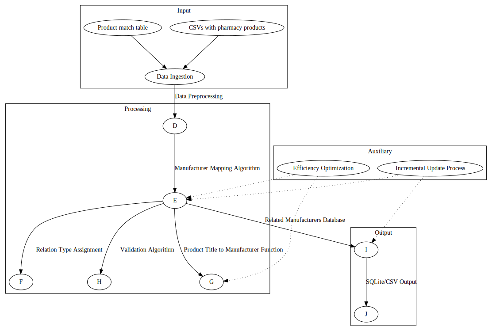

## Manufacturer Mapping System

### System Architecture and Dataflow

1. **Data Ingestion:**  
    The system reads in two types of input data:  
    a) CSVs with pharmacy products from several sources  
    b) Product match table 

    Why it's happening:
    - To gather all necessary data for manufacturer mapping 
    - To establish relationships between products across different sources 

    How it's done: 
    - Set up a data ingestion pipeline to read CSV files 
    - Parse the product match table 
    - Store data in a temporary database or in-memory structure for processing 

2. **Data Preprocessing**  
    Raw data is cleaned, standardized, and prepared for analysis 
    
    Why it's happening: 
    - To ensure data quality and consistency 
    - To optimize data for the mapping algorithm 

    How it's done: 
    - Remove duplicates and handle missing values
    - Standardize manufacturer names (e.g., "Company Inc." and "Company Incorporated" become "Company")  
    - Extract relevant features from product titles and descriptions 

3. **Manufacturer Mapping Algorithm**  
    The core algorithm identifies related manufacturers across different sources 

    Why it's happening: 
    - To create a comprehensive map of manufacturer relationships 
    - To support product matching and brand identification 

    How it's done: 
    - Analyze product matches from the match table 
    - Identify cases where the same product has different manufacturer names 
    - Use string similarity algorithms to group similar manufacturer names 
    - Implement a graph-based approach to connect related manufacturers 

4. **Relation Type Assignment (Optional)**  
    Assigning relation types (parent/child/sibling) between manufacturers 

    Why it's happening: 
    - To provide more detailed insights into manufacturer relationships 
    - To distinguish between brands, product lines, and parent companies 

    How it's done:  
    - Analyze product hierarchies and brand structures 
    - Use natural language processing to extract relationships from product descriptions 
    - Implement rules-based logic to assign relationship types 

5. **Product Title to Manufacturer Function**  
    A function is created to assign manufacturers to products based on their titles 

    Why it's happening:  
    - To automate manufacturer assignment for new products
    - To handle cases where manufacturer information is not explicitly provided

    How it's done:
    - Tokenize product titles
    - Match tokens against the manufacturer database
    - Use fuzzy matching to handle slight variations in names
    - Implement a scoring system to select the most likely manufacturer

6. **Validation Algorithm**  
    An algorithm checks for potential errors in manufacturer matching 

    Why it's happening:
    - To ensure data quality and reduce false positives
    - To identify cases that may require manual review

    How it's done:
    - Implement heuristics to detect common errors (e.g., generic words misidentified as manufacturers)
    - Check for statistical anomalies in manufacturer assignments
    - Flag matches with low confidence scores for manual review

7. **Efficiency Optimization**  
    The system is optimized for speed and efficiency

    Why it's happening:
    - To handle large volumes of data (>100k products initially, thousands daily)
    - To ensure the process is completed in a reasonable timescale

    How it's done:
    - Implement database indexing for faster lookups
    - Use caching mechanisms to store frequently accessed data
    - Parallelize processing where possible
    - Optimize database queries and data structures

8. **Incremental Update Process**  
    The system is designed to handle ongoing updates to the manufacturer mapping

    Why it's happening:
    - To keep the manufacturer database current as new products are added
    - To avoid reprocessing the entire dataset for each update

    How it's done:
    - Implement a change detection mechanism for new or updated products
    - Process only the delta (changes) since the last update
    - Merge new mappings into the existing database
    - Periodically run full reprocessing to ensure overall consistency

9. **Output Generation**  
    The system generates the final output as a SQLite database or CSV file

    Why it's happening:
    - To provide the results in a easily accessible and portable format
    - To support further analysis or integration with other systems

    How it's done:
    - Query the processed data to extract related manufacturers
    - Format the data according to the required output structure
    - Generate either a SQLite database or CSV file
    - Implement data integrity checks on the output

## Purpose
- To gather all necessary data for manufacturer mapping
- To establish relationships between products across different sources